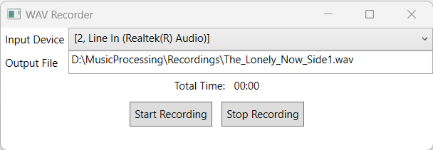
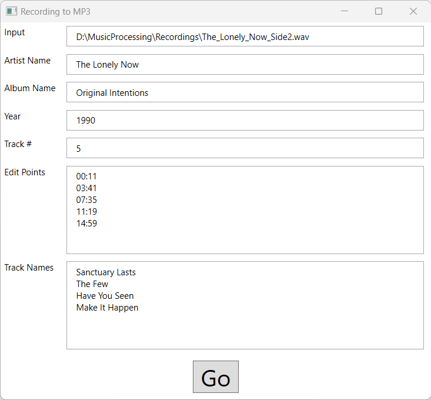
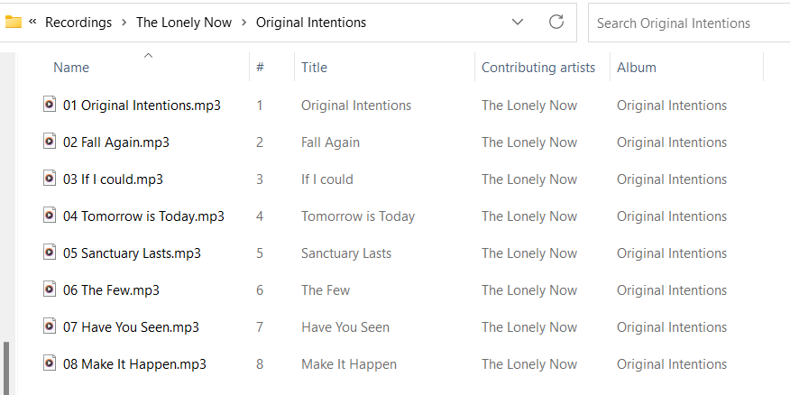
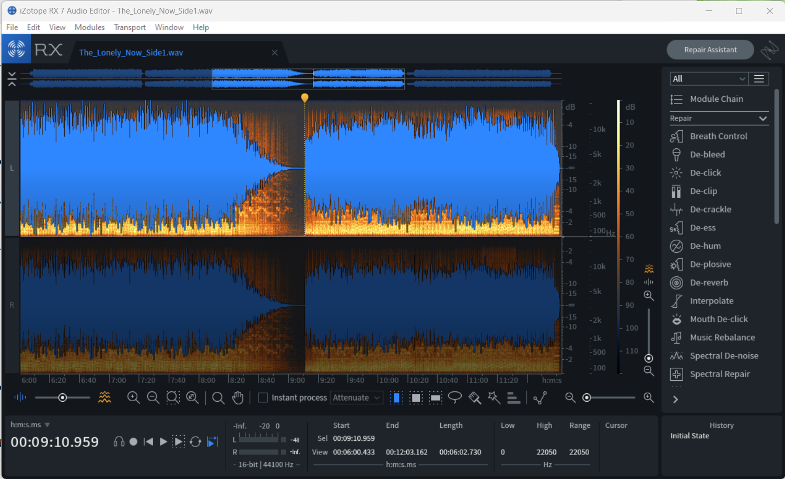

# cassette-to-mp3

Convert audio cassettes to MP3 files. Both a combined application and separate applications for each step are available. This uses C#/.NET 7 (with WPF for the UI). These applications will run on Windows only. This is a work-in-progress.

*Note: These projects use NAudio for recording, editing, and converting.*

## Recording
The **WAVRecorder** application lets you record from LineIn (or other audio source) to a WAV file. Since I'm recording from cassette tapes, I record an entire side.  

* Input Device  
Drop-down and includes the current input devices for the PC.  
* Output File  
The name of the file to record to.  
*Note: double-clicking the Output File box will open a standard save file dialog.*  
* Start Recording  
Starts the recording. The audio is streamed to the file system.
* Stop Recording  
Stops the recording and closes the file.

## Splitting / Converting / Tagging  
The **RecordingToMP3** application splits the recording into separate files, converts them to MP3s, tags them with basic information, and saves them as "[Artist]\[Album]\[Track Number] [Track Name].mp3".  

* **Input**  
The name of the input file.  
*Note: double-click the Input box to open a standard open file dialog.*  

* **Artist Name**  
Used for folder and file tags.

* **Album Name**  
Used for folder and file tags.  

* **Year**  
Used for file tags.  

* **Track #**  
The starting track number for this recording. This is useful when processing Side 2 of an album. For example, if you set this value to 5, then the track numbers will be 5, 6, 7, 8, etc..  

* **Edit Points**  
These are markers (in minute:second format) for where files should be split.  
    * The first one is the starting point. For example, if I want to trim the first 11 seconds of silence from the recording, the first entry would be "00:11".  
    * The second edit point is the start of the second track.  
    * The last edit point is the end of the last track (to trim end silence).  

* **Track Names**  
These are the name of the tracks.  

> Note: There should be 1 more edit point than tracks. So if there are 5 tracks, there should be 6 edit points and 5 track names. (There is currently no error handling that checks this.)  

* **Go**  
This starts the process. There is a "Done" popup when it is completed.  

### Output  
If all goes well, the output files are put into an artist/album folder in the selected input directory.  

  

### Edit Points  
Getting the edit points is currently a manual process. You can use any audio editing software that lets you see the waveform to pick out the edit points.  

I use iZotope RX 7, and it looks like this:  
  

In this example, I have found an edit point at 09:11 for the start of a track.

## Projects
1. [WAVRecorder](./WAVRecorder/)  
Desktop application to record from a PC audio source (such as LineIn) to a WAV file.  
I use this to record a side of a cassette tape from and an Akai HX-1C through a PC input.

2. [RecordingToMP3](./RecordingToMP3/)  
A desktop application that splits the recording (from WAVRecorder) into separate tracks/files and converts them to MP3 with appropriate tags.  
*Note: Double-click the "input" box to open a file dialog to pick the WAV source.*  
The output creates folders for artist and album under the original source folder.

3. [AudioProcessorLibrary](./AudioProcessorLibrary/)  
Combined library to support entire workflow (used by RecordingToMP3).  

4. [WAVSplitter](./WAVSplitter/)  
Desktop application to split a WAV file into separate files based on provided timestamps.  
I use this to split a recording of a full side of a cassette tape into individual tracks.  
*Note: I get the timestamps by looking at the WAV file in an audio editor.*  
**This functionality is included in "RecordingToMP3".**  

5. [WAVtoMP3](./WAVtoMP3/)  
Desktop application to convert the separate wave files into MP3s based on provided track names.  
**This functionality is included in "RecordingToMP3".**  

6. [MP3Tagger](./MP3Tagger/)
Desktop application to add ID3 tags to MP3 files.  
**This functionality is included in "RecordingToMP3".**  

7. [TesterApp](./TesterApp/)  
Console application to test the workflow on a single, hard-coded file. (working!)

## Enhancements
I've got the following features planned.  

* ~~Combination of splitting and converting to MP3 as a single application.~~ **DONE**  
* ~~Add MP3 tags (artist, album, track, year, etc.)~~ **DONE**  
* Validation for mis-matched number of edit points and track names, malformed input, and others.
* Make the UI look better (it's just sort of functional now).  
* See if I can figure out a way to "auto-split" (although I'm not sure I would trust this since albums vary in moving from track to track).  

## Notes  
This started because I got a portable boom box that converted tapes to MP3. The quality was truly awful (and the MP3s were encoded strangely). This inspired me to hook up a good cassette deck to a PC to get better recordings, and possibly run them through audio editing software before converting them to MP3s.  

***